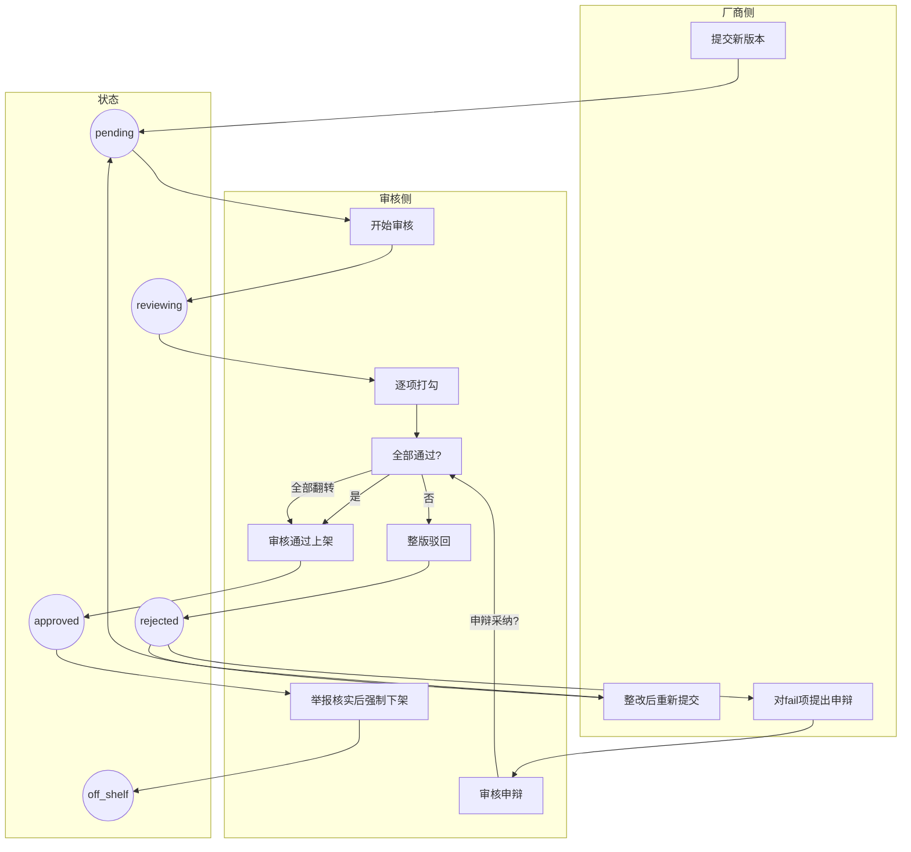

# 上架审核流程代码说明

## 一、系统概览

本系统是一套应用上架合规审核平台，完整实现了以下核心流程：

**厂商提交版本 → 审核员对照合规检查清单逐项审核 → 一项不通过即驳回整版 → 厂商整改后重新提交走新一轮审核 → 已上架版本可因举报核实被强制下架**

系统还支持厂商对单项不通过结果提出申辩，申辩全部采纳后可翻转整版审核结果。

---

## 二、核心数据模型

### 2.1 数据表关系总览

```
app_categories (应用类别)
    │
    ├── category_template_mapping ──→ checklist_templates (清单模板)
    │                                      │
    │                                      ├── template_item_mapping ──→ check_items (检查项库)
    │                                      │
    │                                      └── checklist_versions (清单版本，快照)
    │                                               │
    │                                               └── checklist_version_items (版本快照明细)
    │
    └── app_versions (应用版本)  ←───────────────────┘
             │
             ├── review_records (审核记录，每轮一条)
             │        │
             │        ├── checklist_version_id ──→ checklist_versions (本轮使用的清单版本)
             │        │
             │        └── review_item_results (逐项审核结果)
             │                 │
             │                 └── appeals (申辩记录)
             │
             └── shelf_status / shelf_off_reason / shelf_off_time (下架信息)
```

### 2.2 关键表与字段详解

#### app_versions（应用版本表）
这是整个审核流程的主表，每个待审核版本一条记录。

| 字段 | 类型 | 含义 | 备注 |
|------|------|------|------|
| `id` | INTEGER | 主键 | 自增 |
| `app_name` | TEXT | 应用名称 | - |
| `version_no` | TEXT | 版本号 | - |
| `vendor` | TEXT | 厂商 | - |
| `category_id` | INTEGER | 应用类别ID | 关联 app_categories |
| `status` | TEXT | 审核状态 | `pending` / `reviewing` / `rejected` / `approved` |
| `submit_time` | DATETIME | 提交时间 | 每次重新提交会更新 |
| `review_start_time` | DATETIME | 最近一次审核开始时间 | - |
| `review_end_time` | DATETIME | 最近一次审核结束时间 | - |
| `reject_count` | INTEGER | 累计驳回次数 | **每驳回一次 +1，重新提交不清零** |
| `shelf_status` | TEXT | 上架状态 | `normal` / `off_shelf` |
| `shelf_off_reason` | TEXT | 下架原因 | - |
| `shelf_off_time` | DATETIME | 下架时间 | - |

> **设计要点**：`status` 和 `shelf_status` 是两个独立维度。`status` 描述审核进度，`shelf_status` 描述是否在架。一个已通过审核的版本（`status=approved`）可以被强制下架（`shelf_status=off_shelf`），但它在审核维度上仍然是"通过"的。

#### review_records（审核记录表）
每一轮审核对应一条记录。一个版本被驳回 N 次再通过，就会有 N+1 条审核记录。

| 字段 | 类型 | 含义 | 备注 |
|------|------|------|------|
| `id` | INTEGER | 主键 | - |
| `version_id` | INTEGER | 版本ID | 关联 app_versions |
| `review_round` | INTEGER | 审核轮次 | 第 1 轮、第 2 轮... |
| `reviewer` | TEXT | 审核员 | - |
| `checklist_version_id` | INTEGER | 使用的清单版本ID | 关联 checklist_versions |
| `start_time` | DATETIME | 开始时间 | - |
| `end_time` | DATETIME | 结束时间 | 提交审核结果时设置 |
| `result` | TEXT | 本轮结论 | `approved` / `rejected` |
| `reject_reason` | TEXT | 总体驳回原因 | - |

> **设计要点**：`review_round = app_versions.reject_count + 1`。每次开始新审核时用当前 `reject_count + 1` 作为本轮轮次号。

#### review_item_results（审核项结果表）
每轮审核中，每个检查项对应一条结果记录。

| 字段 | 类型 | 含义 | 备注 |
|------|------|------|------|
| `id` | INTEGER | 主键 | - |
| `record_id` | INTEGER | 审核记录ID | 关联 review_records |
| `check_item_id` | INTEGER | 检查项ID | 关联 check_items |
| `checklist_version_item_id` | INTEGER | 清单版本项ID | 关联 checklist_version_items（快照） |
| `result` | TEXT | 单项结果 | `pass` / `fail` |
| `comment` | TEXT | 审核备注 | fail 项通常有备注 |
| `has_appeal` | INTEGER | 是否已申辩 | 0/1 |
| `appeal_result` | TEXT | 申辩结果 | `accepted` / `rejected` |

> **设计要点**：同时存了 `check_item_id` 和 `checklist_version_item_id`。前者关联检查项主数据，后者关联审核时的清单版本快照。即使后续检查项库修改了，历史审核记录仍然能还原当时审核的内容。

---

## 三、版本状态定义与流转

### 3.1 状态枚举值定义

审核状态定义在 [versions.js](file:///Users/huangding/Documents/SOLOCODE%203/0612/mbp/zj-00254-shelfgate-6/server/routes/versions.js#L5-L10) 的 `STATUS_MAP` 中：

```javascript
const STATUS_MAP = {
  pending: "待审",
  reviewing: "审核中",
  rejected: "驳回",
  approved: "通过上架",
};
```

上架状态定义在同文件的 `SHELF_STATUS_MAP` 中：

```javascript
const SHELF_STATUS_MAP = {
  normal: "正常上架",
  off_shelf: "已下架",
};
```

### 3.2 状态流转图（Mermaid）

```mermaid
stateDiagram-v2
    [*] --> pending : 厂商提交新版本
    pending --> reviewing : 审核员「开始审核」
    reviewing --> approved : 全部检查项通过
    reviewing --> rejected : 任一检查项不通过
    rejected --> pending : 厂商「重新提交」
    approved --> off_shelf : 举报核实「强制下架」
    
    rejected --> approved : 所有fail项申辩均采纳
    
    state pending {
        description: 版本已提交，等待审核员领取
    }
    state reviewing {
        description: 审核员正在逐项打勾
    }
    state rejected {
        description: 本轮审核有不通过项
    }
    state approved {
        description: 审核通过，可上架
    }
    state off_shelf {
        description: 已强制下架
        note left of off_shelf : shelf_status 维度<br>status 仍为 approved
    }
```

### 3.3 各状态流转的代码控制点

#### 1. 提交新版本 → pending

**代码位置**：[versions.js POST /](file:///Users/huangding/Documents/SOLOCODE%203/0612/mbp/zj-00254-shelfgate-6/server/routes/versions.js#L175-L213)

```javascript
INSERT INTO app_versions (app_name, version_no, vendor, category_id, status)
VALUES (?, ?, ?, ?, 'pending')
```

**控制逻辑**：
- 必填：应用名、版本号、厂商
- 唯一约束：`(app_name, version_no, vendor)` 联合唯一
- 初始状态固定为 `pending`
- `reject_count` 默认为 0

#### 2. pending → reviewing（开始审核）

**代码位置**：[reviews.js POST /start/:versionId](file:///Users/huangding/Documents/SOLOCODE%203/0612/mbp/zj-00254-shelfgate-6/server/routes/reviews.js#L157-L255)

**前置校验**（卡在哪个环节看这里）：
1. 版本必须存在
2. 版本状态必须是 `pending`，否则返回："当前状态不允许开始审核，请先由厂商重新提交"
3. 不能有未完成的审核记录（`end_time IS NULL`），否则返回："存在未完成的审核记录，请先完成当前审核"
4. 审核轮次校验：`review_round` 不能 >= `reject_count + 1`（防止轮次混乱）

**执行操作**（事务内）：
```sql
-- 更新版本状态
UPDATE app_versions 
SET status = 'reviewing', review_start_time = CURRENT_TIMESTAMP
WHERE id = ?

-- 创建审核记录，轮次 = reject_count + 1
INSERT INTO review_records (version_id, review_round, reviewer, checklist_version_id, start_time)
VALUES (?, ?, ?, ?, CURRENT_TIMESTAMP)
```

**清单版本选取逻辑**：
1. 如果版本有 `category_id`，通过 `category_template_mapping` 找到关联的清单模板
2. 取该模板下最新的已锁定（`is_locked=1`）清单版本
3. 绑定到本轮审核记录的 `checklist_version_id`
4. 如果没配置类别或没可用清单版本，则 `checklist_version_id = null`，审核时用 `check_items` 活跃项兜底

#### 3. reviewing → approved / rejected（提交审核结果）

**代码位置**：[reviews.js POST /submit/:versionId](file:///Users/huangding/Documents/SOLOCODE%203/0612/mbp/zj-00254-shelfgate-6/server/routes/reviews.js#L257-L425)

**前置校验**：
1. 版本状态必须是 `reviewing`
2. 必须有未完成的审核记录（`end_time IS NULL`）
3. 审核轮次必须匹配：`review_round === reject_count + 1`
4. 必须提交所有检查项的结果（不允许遗漏），缺项返回："请完成所有 N 项检查，还有 M 项未审核"
5. 每项结果值必须是 `pass` 或 `fail`
6. 检查项 ID 必须在清单范围内

**一票否决逻辑**（核心）：
```javascript
const hasFail = results.some((r) => r.result === "fail");
const finalResult = hasFail ? "rejected" : "approved";
```

> 只要有一项 fail，整版驳回。这就是"一项不过整版驳回"的代码实现。

**执行操作**（事务内）：
1. 批量写入 `review_item_results`（每个检查项一条）
2. 更新 `review_records`：设置 `end_time`、`result`、`reject_reason`
3. 更新 `app_versions`：
   - 驳回：`status='rejected'`, `review_end_time=now`, `reject_count += 1`
   - 通过：`status='approved'`, `review_end_time=now`, `shelf_status='normal'`

#### 4. rejected → pending（重新提交）

**代码位置**：[reviews.js POST /re-submit/:versionId](file:///Users/huangding/Documents/SOLOCODE%203/0612/mbp/zj-00254-shelfgate-6/server/routes/reviews.js#L464-L490)

**前置校验**：
- 版本状态必须是 `rejected`，否则返回："只有驳回状态的版本才能重新提交"

**执行操作**：
```sql
UPDATE app_versions 
SET status = 'pending', 
    submit_time = CURRENT_TIMESTAMP, 
    review_start_time = NULL, 
    review_end_time = NULL
WHERE id = ?
```

> **关键细节**：`reject_count` **不会被清零**。它保留历史累计值，下一轮审核时 `review_round = reject_count + 1` 才能正确递增轮次号。

#### 5. approved → off_shelf（强制下架）

**代码位置**：[reviews.js POST /off-shelf/:versionId](file:///Users/huangding/Documents/SOLOCODE%203/0612/mbp/zj-00254-shelfgate-6/server/routes/reviews.js#L427-L462)

**前置校验**：
1. 版本状态必须是 `approved`（只有已通过的才能下架）
2. `shelf_status` 不能已经是 `off_shelf`（不能重复下架）
3. 必须填写下架原因

**执行操作**：
```sql
UPDATE app_versions 
SET shelf_status = 'off_shelf', 
    shelf_off_reason = ?, 
    shelf_off_time = CURRENT_TIMESTAMP
WHERE id = ?
```

> **设计要点**：下架只改 `shelf_status`，不改 `status`。也就是说，下架版本在审核历史上仍然是"通过"的，只是在上架维度被移除了。这样设计的好处是：如果后续要恢复上架，不需要重新走审核流程。

---

## 四、驳回记录的数据结构

### 4.1 驳回次数怎么记

驳回次数存储在两个地方，互为备份：

**1. 版本级汇总字段**：`app_versions.reject_count`
- 每次驳回 +1
- 重新提交不清零
- 读起来快，列表页直接展示

**2. 审核记录级明细**：`review_records` 中 `result='rejected'` 的记录数
- 每条驳回的审核记录算一次
- 可以追溯每一轮驳回的细节

**数据一致性保障**：
系统初始化时会运行 [fixDataConsistency()](file:///Users/huangding/Documents/SOLOCODE%203/0612/mbp/zj-00254-shelfgate-6/server/db/schema.js#L756-L836) 函数，自动校验并修复两者不一致的情况。

```javascript
// 实际驳回次数 = 统计 review_records 中 result='rejected' 的条数
const actualRejects = db.prepare(`
  SELECT COUNT(*) as count FROM review_records 
  WHERE version_id = ? AND result = 'rejected'
`).get(v.id).count;

// 不一致就修正
if (current.reject_count !== actualRejects) {
  updateRejectCount.run(actualRejects, v.id);
}
```

### 4.2 每次驳回卡在哪些检查项

通过三层关联可以完整还原任意一轮的驳回细节：

```
app_versions (版本)
  └── review_records (审核记录，每轮一条)
        ├── review_round (第几轮)
        ├── result (approved / rejected)
        ├── reject_reason (总体驳回原因)
        └── review_item_results (逐项结果)
              ├── check_item_id / checklist_version_item_id
              ├── result (pass / fail)
              └── comment (备注)
```

查询 SQL 示例：

```sql
SELECT 
  rr.review_round,
  rr.result as round_result,
  rr.reject_reason,
  rr.start_time,
  rr.end_time,
  cvi.check_item_code,
  cvi.check_item_name,
  cvi.check_item_category,
  rir.result as item_result,
  rir.comment
FROM review_records rr
JOIN review_item_results rir ON rir.record_id = rr.id
LEFT JOIN checklist_version_items cvi 
  ON rir.checklist_version_item_id = cvi.id
WHERE rr.version_id = ?
ORDER BY rr.review_round, cvi.sort_order
```

版本详情接口已经实现了这个查询，参见 [versions.js GET /:id](file:///Users/huangding/Documents/SOLOCODE%203/0612/mbp/zj-00254-shelfgate-6/server/routes/versions.js#L77-L173)。

---

## 五、多轮重审机制串讲

### 5.1 核心变量关系

```
reject_count (版本累计驳回次数)
    │
    ├── 初始值：0
    ├── 每驳回一次：+1
    └── 重新提交：不变
    
review_round (当前审核轮次)
    │
    └── 开始审核时计算：reject_count + 1
```

每一轮审核都有独立的 `review_records` 和一组 `review_item_results`，历史数据完整保留，不会被覆盖。

### 5.2 完整多轮重审时序

以一个典型场景为例（对应种子数据「每日头条 v3.8.1」）：

**第 1 轮审核：**
```
1. 厂商提交版本
   → app_versions: status='pending', reject_count=0

2. 审核员开始审核
   → status='reviewing'
   → review_records 新增一条: review_round=1

3. 审核员逐项打勾，第 3 项 fail
   → review_item_results 写入 8 条记录
   → 检测到有 fail → finalResult='rejected'
   
4. 提交审核结果
   → review_records: result='rejected', end_time=now
   → app_versions: status='rejected', reject_count=1
```

**第 2 轮审核（厂商整改后）：**
```
5. 厂商点击「重新提交」
   → app_versions: status='pending', submit_time=now
   → 注意：reject_count 仍为 1，不会清零

6. 审核员再次开始审核
   → status='reviewing'
   → review_round = reject_count + 1 = 2
   → review_records 新增一条: review_round=2

7. 逐项打勾，第 3 项仍 fail，第 7 项新增 fail
   → review_item_results 又写入 8 条记录（第 2 轮的）
   
8. 提交审核结果
   → review_records: result='rejected'
   → app_versions: status='rejected', reject_count=2
```

**第 3 轮审核（继续整改）：**
```
9. 厂商重新提交 → status='pending'

10. 开始审核 → review_round=3

11. 全部通过 → finalResult='approved'

12. 提交结果
    → review_records: result='approved'
    → app_versions: status='approved', shelf_status='normal'
    → reject_count 停留在 2（不再增加）
```

最终这个版本有 3 条审核记录（2 条 rejected + 1 条 approved），`reject_count = 2`。

### 5.3 轮次号怎么算不会错

开始审核时的轮次计算逻辑在 [reviews.js](file:///Users/huangding/Documents/SOLOCODE%203/0612/mbp/zj-00254-shelfgate-6/server/routes/reviews.js#L191)：

```javascript
const currentRound = version.reject_count + 1;
```

还有一道防呆校验：

```javascript
const lastRecord = db.prepare(`
  SELECT * FROM review_records 
  WHERE version_id = ?
  ORDER BY review_round DESC LIMIT 1
`).get(versionId);

if (lastRecord && lastRecord.review_round >= currentRound) {
  return res.json({
    code: 1,
    message: "审核轮次异常，请先由厂商重新提交",
  });
}
```

确保新一轮的轮次号一定比历史最大轮次大，避免轮次重复或倒退。

---

## 六、申辩机制

### 6.1 申辩条件

代码位置：[appeals.js POST /](file:///Users/huangding/Documents/SOLOCODE%203/0612/mbp/zj-00254-shelfgate-6/server/routes/appeals.js#L124-L202)

- 只能对 `result = 'fail'` 的审核项提出申辩
- 版本状态必须为 `rejected`
- 同一审核项只能申辩一次（`has_appeal` 标记防止重复）

### 6.2 申辩采纳的连锁效应

代码位置：[appeals.js POST /review/:id](file:///Users/huangding/Documents/SOLOCODE%203/0612/mbp/zj-00254-shelfgate-6/server/routes/appeals.js#L204-L306)

当某项 fail 的申辩被采纳（`review_result = 'accepted'`）时，系统会检查：

```sql
SELECT COUNT(*) as count 
FROM review_item_results 
WHERE record_id = ? 
  AND result = 'fail' 
  AND (appeal_result IS NULL OR appeal_result != 'accepted')
```

- 如果**还有未翻转的 fail 项**：只更新该项的 `appeal_result`，版本状态保持 `rejected`
- 如果**所有 fail 项的申辩都被采纳了**（计数 = 0）：
  - `review_records.result` 从 `rejected` → `approved`
  - `app_versions.status` 从 `rejected` → `approved`
  - `review_end_time` 更新为当前时间

这是"逐项申辩、全部采纳即翻盘"的实现逻辑。

---

## 七、完整生命周期流程图



---

## 八、API 速查表

| 操作 | 方法 | 路径 | 状态变化 | 代码文件 |
|------|------|------|---------|---------|
| 提交新版本 | POST | `/api/versions` | → pending | [versions.js](file:///Users/huangding/Documents/SOLOCODE%203/0612/mbp/zj-00254-shelfgate-6/server/routes/versions.js) |
| 版本列表 | GET | `/api/versions` | - | [versions.js](file:///Users/huangding/Documents/SOLOCODE%203/0612/mbp/zj-00254-shelfgate-6/server/routes/versions.js) |
| 版本详情(含所有轮次) | GET | `/api/versions/:id` | - | [versions.js](file:///Users/huangding/Documents/SOLOCODE%203/0612/mbp/zj-00254-shelfgate-6/server/routes/versions.js) |
| 开始审核 | POST | `/api/reviews/start/:id` | pending → reviewing | [reviews.js](file:///Users/huangding/Documents/SOLOCODE%203/0612/mbp/zj-00254-shelfgate-6/server/routes/reviews.js) |
| 获取检查项清单 | GET | `/api/reviews/check-items` | - | [reviews.js](file:///Users/huangding/Documents/SOLOCODE%203/0612/mbp/zj-00254-shelfgate-6/server/routes/reviews.js) |
| 提交审核结果 | POST | `/api/reviews/submit/:id` | reviewing → approved/rejected | [reviews.js](file:///Users/huangding/Documents/SOLOCODE%203/0612/mbp/zj-00254-shelfgate-6/server/routes/reviews.js) |
| 重新提交 | POST | `/api/reviews/re-submit/:id` | rejected → pending | [reviews.js](file:///Users/huangding/Documents/SOLOCODE%203/0612/mbp/zj-00254-shelfgate-6/server/routes/reviews.js) |
| 强制下架 | POST | `/api/reviews/off-shelf/:id` | shelf_status → off_shelf | [reviews.js](file:///Users/huangding/Documents/SOLOCODE%203/0612/mbp/zj-00254-shelfgate-6/server/routes/reviews.js) |
| 提交申辩 | POST | `/api/appeals` | - | [appeals.js](file:///Users/huangding/Documents/SOLOCODE%203/0612/mbp/zj-00254-shelfgate-6/server/routes/appeals.js) |
| 审核申辩 | POST | `/api/appeals/review/:id` | 可能翻转版本状态 | [appeals.js](file:///Users/huangding/Documents/SOLOCODE%203/0612/mbp/zj-00254-shelfgate-6/server/routes/appeals.js) |
| 统计概览 | GET | `/api/stats/overview` | - | [stats.js](file:///Users/huangding/Documents/SOLOCODE%203/0612/mbp/zj-00254-shelfgate-6/server/routes/stats.js) |

---

## 九、新人上手指北

想看懂这套审核代码，按这个顺序看：

1. **先看表结构**：[schema.js](file:///Users/huangding/Documents/SOLOCODE%203/0612/mbp/zj-00254-shelfgate-6/server/db/schema.js)
   重点看 `app_versions`、`review_records`、`review_item_results` 三张表的字段和关系

2. **再看主流程**：[reviews.js](file:///Users/huangding/Documents/SOLOCODE%203/0612/mbp/zj-00254-shelfgate-6/server/routes/reviews.js)
   - `/start/:versionId`：开始审核
   - `/submit/:versionId`：提交结果（核心的一票否决逻辑在这里）
   - `/re-submit/:versionId`：重新提交
   - `/off-shelf/:versionId`：强制下架

3. **然后看申辩**：[appeals.js](file:///Users/huangding/Documents/SOLOCODE%203/0612/mbp/zj-00254-shelfgate-6/server/routes/appeals.js)
   重点看申辩采纳后怎么翻转审核结果

4. **最后看清单**：[checklists.js](file:///Users/huangding/Documents/SOLOCODE%203/0612/mbp/zj-00254-shelfgate-6/server/routes/checklists.js)
   检查项、模板、清单版本快照机制

5. **前端交互**：[app.js](file:///Users/huangding/Documents/SOLOCODE%203/0612/mbp/zj-00254-shelfgate-6/public/js/app.js)
   可以对照前端操作理解后端逻辑
